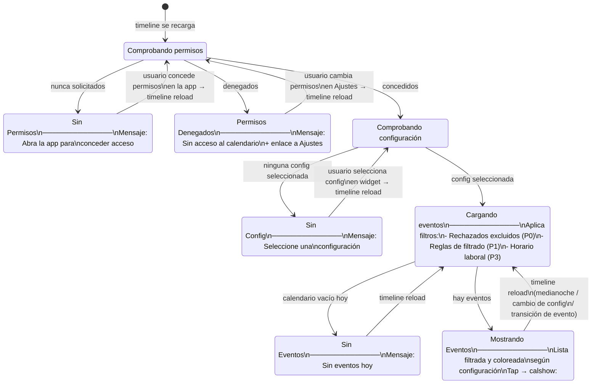
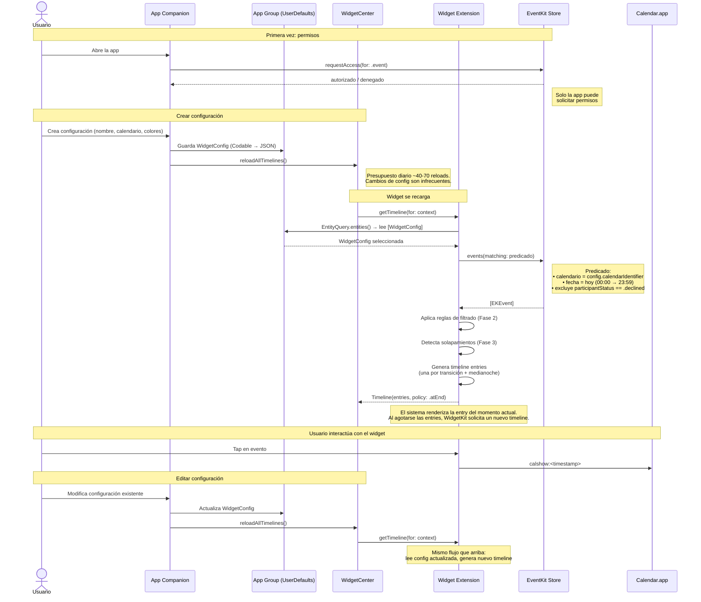
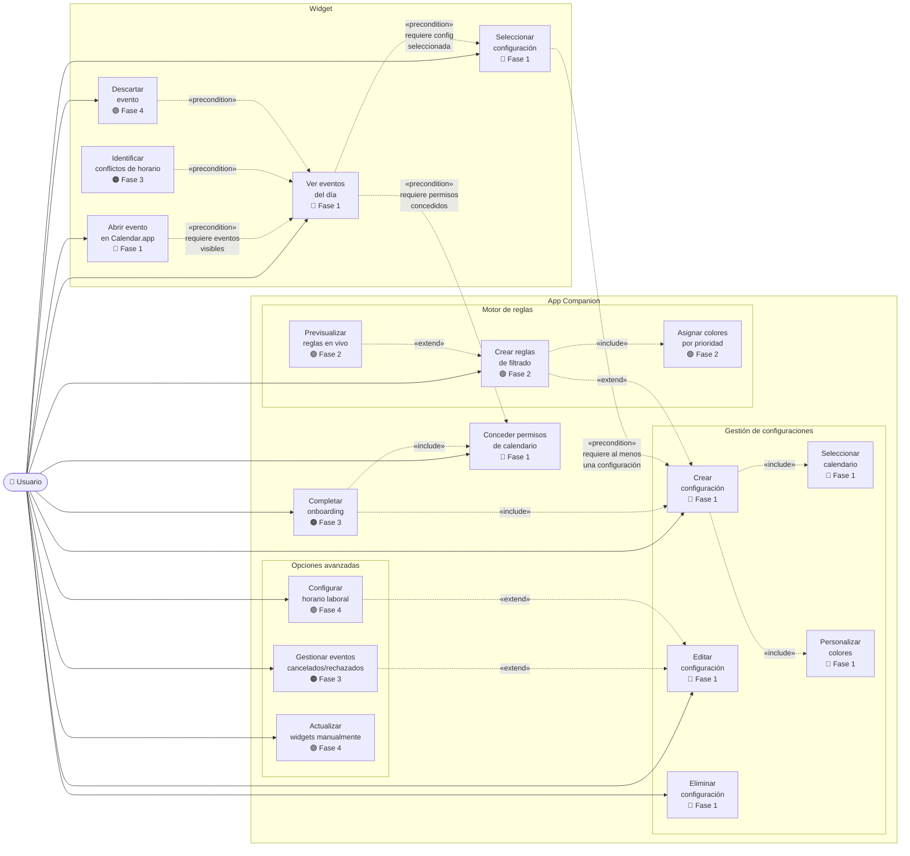

# iOS Widget Calendario — Resumen del Proyecto

## Tabla de contenidos

| # | Historia | Prioridad | Descripcion |
|---|---|---|---|
| | **Épica 1 — Lectura y visualización** | | |
| 1.1 | Lectura básica de eventos | P0 | Leer eventos del calendario via EventKit |
| 1.2 | Renderizado en distintos tamaños | P0 | Small, Medium, Large, Extra Large (iPad) |
| | **Épica 2 — Permisos y estados** | | |
| 2.1 | Manejo de permisos | P0 | Solicitar acceso desde la app; el widget solo detecta estado |
| 2.2 | Estado sin eventos | P0 | Mensaje cuando la agenda está vacía |
| 2.3 | Modo claro y oscuro | P0 | Adaptación automática a la apariencia del sistema |
| | **Épica 3 — Interacción y personalización** | | |
| 3.1 | Abrir evento | P0 | Pulsar evento abre Calendar.app en la fecha del evento |
| 3.2 | Selección de configuración en el widget | P0 | El widget solo permite elegir qué configuración (creada en la app) usar |
| 3.3 | Widgets interactivos (iOS 17+) | P3 | Descartar eventos desde el widget |
| | **Épica 4 — Filtrado y resaltado** | | |
| 4.1 | Reglas de filtrado | P1 | Filtrar eventos por texto o regex |
| 4.2 | Colores por prioridad de regla | P1 | Color según prioridad de la regla que coincide |
| 4.3 | Vista previa en vivo de reglas | P1 | Probar reglas contra los últimos 50 eventos |
| | **Épica 5 — Optimización y actualizaciones** | | |
| 5.1 | Horario laboral | P3 | Mostrar solo eventos dentro del horario definido |
| 5.2 | Actualización manual | P3 | Forzar refresh desde la app companion |
| 5.3 | Eventos solapados | P2 | Visualizar conflictos de horario |
| 5.4 | Eventos cancelados y rechazados | P0/P2 | Filtrar rechazados por defecto (P0); toggle y cancelados tachados (P2) |
| | **Épica 6 — App companion** | | |
| 6.1 | App companion | P0 | App donde se crea y gestiona toda la configuración de cada widget (calendario, colores, reglas) |
| 6.2 | Onboarding | P2 | Guía inicial y primer widget |

---

## Problema

Cuando se tienen muchos eventos en un único calendario profesional, no existe una manera de filtrar o destacar eventos en iOS, ni una visualización clara en días con muchas citas.

---

## Solución

Se desarrollará un conjunto de **widgets de iOS** y una **app companion** que permita:

1. Filtrar y resaltar eventos mediante reglas.
2. Optimizar la visualización incluso con muchos eventos.
3. Crear múltiples widgets independientes con sus propias configuraciones.
4. Ofrecer superficies de visualización en Home Screen.

---

## Diagramas

### Arquitectura de Componentes

Muestra la app companion, la widget extension, el App Group, EventKit y las fronteras de proceso.

```mermaid
flowchart TB
    subgraph iOS["Dispositivo iOS"]
        subgraph app_process["App Companion (proceso app)"]
            views["SwiftUI\nViews"]
            configMgr["Config\nManager"]
            ekPerms["Permisos\nEventKit"]
        end

        subgraph widget_process["Widget Extension (proceso independiente)"]
            timeline["Timeline\nProvider"]
            entityQuery["AppIntent\nEntityQuery"]
            ekReader["EventKit\nReader"]
            widgetViews["SwiftUI\nWidget Views"]
        end

        subgraph appGroup[("App Group — UserDefaults(suiteName:)")]
            configs["[WidgetConfig]"]
            dismissed["[DismissedEvents]"]
        end
    end

    subgraph frameworks["Frameworks iOS"]
        widgetKit["WidgetKit\n[Presupuesto diario: ~40-70 reloads]"]
        ekStore["EventKit Store"]
    end

    calApp["Calendar.app"]

    subgraph calSources["Fuentes de calendario"]
        iCloud["iCloud"]
        exchange["Exchange"]
        google["Google CalDAV"]
    end

    views -->|"crea / edita configuración"| configMgr
    configMgr -->|"escribe WidgetConfig[]"| configs
    configMgr -->|"reloadAllTimelines()"| widgetKit
    ekPerms -->|"requestAccess(for: .event)\nSolo la app puede solicitar permisos"| ekStore

    widgetKit -->|"getTimeline(for: config)"| timeline
    timeline --> entityQuery
    entityQuery -->|"lee config seleccionada"| configs
    timeline -->|"eventos del día"| ekReader
    ekReader -->|"events(matching:)"| ekStore
    timeline -->|"genera timeline entries"| widgetViews
    widgetViews -.->|"calshow:<timestamp>"| calApp

    calSources -->|"sincroniza"| ekStore
```

> **Nota**: App y Widget acceden al mismo contenedor App Group pero ejecutan en procesos separados.

---

### Estados del Widget

Máquina de estados: sin permisos → sin config → sin eventos → mostrando eventos.



---

### Flujo de Configuración (App → Widget)

Secuencia: crear config en app → App Group → reload → widget renderiza.



---

### Casos de Uso

Casos de uso con relaciones include/extend/precondition, coloreados por fase.



**Leyenda de fases:**
| Color | Fase |
|---|---|
| 🔵 Azul | Fase 1 — MVP |
| 🟢 Verde | Fase 2 — Motor de reglas |
| 🟠 Naranja | Fase 3 — App Store |
| 🟣 Morado | Fase 4 — Extras |

---

## Decisiones técnicas

| Decisión | Valor | Justificación |
|---|---|---|
| Deployment target | iOS 17.0+ | Requerido para `AppIntentConfiguration`, widgets interactivos y Swift Regex |
| Plataforma | Universal (iPhone + iPad) | Extra Large disponible en iPad |
| Persistencia compartida | `UserDefaults(suiteName:)` con App Group | SwiftData tiene riesgo de corrupción con acceso concurrente app/widget. UserDefaults es atómico y suficiente para configuraciones pequeñas (JSON codificable) |
| Configuración del widget | `AppIntentConfiguration` + `AppEntity` | API moderna (iOS 17+). El picker del widget consulta las configuraciones del App Group via `EntityQuery` |
| Estrategia de timeline | Una entrada por transición de evento + entrada a medianoche, política `.atEnd` | Permite que el widget refleje cambios de estado sin consumir reload budget |
| Lectura de eventos | EventKit (solo `EKEventStore`, sin EventKitUI) | EventKitUI no es necesario: solo leemos eventos, no los editamos |
| Navegación al evento | URL scheme `calshow:<unix_timestamp>` | No existe deep link público a un evento concreto en Calendar.app |
| Regex engine | Swift `Regex` (tipo nativo, iOS 16+) | Validación en tiempo de edición en la app companion. En el widget extension (30 MB de RAM), solo se ejecutan regex ya compilados |
| Comunicación app → widget | `WidgetCenter.shared.reloadAllTimelines()` al guardar config | El widget se recarga con la nueva configuración. Sujeto a presupuesto diario (~40-70 reloads) |
| Sin dependencias de terceros | — | Todo el stack es frameworks de Apple |

---

## Roadmap

### Fases

**Fase 0 — Infraestructura** *(prerequisito técnico)*

Crear el proyecto Xcode con dos targets (app + widget extension), configurar App Group compartido, definir el modelo `WidgetConfig` (Codable), y el skeleton de `AppEntity` + `EntityQuery`.

**Fase 1 — MVP vertical** *(primera versión usable end-to-end)*

| Orden | Historia | Justificación del orden |
|---|---|---|
| 1 | 6.1 App companion (versión mínima) | Crea configuraciones que el widget consumirá |
| 2 | 2.1 Permisos | La app solicita acceso al calendario |
| 3 | 1.1 Lectura de eventos | EventKit lee el calendario seleccionado en la config |
| 4 | 1.2 Renderizado (Medium primero) | Mostrar eventos en el widget |
| 5 | 3.2 Picker de configuración | El widget expone el picker para elegir qué config usar |
| 6 | 3.1 Abrir evento (calshow:) | Tap en evento abre Calendar.app |
| 7 | 2.2 Estado sin eventos | Mensaje cuando no hay eventos |
| 8 | 5.4 Cancelados/rechazados (solo filtrado por defecto) | Filtrar eventos rechazados en el predicado de EventKit |

**Fase 2 — Motor de reglas** *(core del valor de negocio)*

| Orden | Historia |
|---|---|
| 1 | 4.1 Reglas de filtrado |
| 2 | 4.2 Colores por prioridad |
| 3 | 4.3 Vista previa en vivo |

**Fase 3 — Pulido para App Store**

| Historia |
|---|
| 2.3 Modo claro/oscuro (colores custom) |
| 5.4 Cancelados/rechazados (toggle + tachado) |
| 5.3 Eventos solapados |
| 6.2 Onboarding |

**Fase 4 — Extras**

| Historia |
|---|
| 3.3 Widgets interactivos |
| 5.1 Horario laboral |
| 5.2 Actualización manual |
